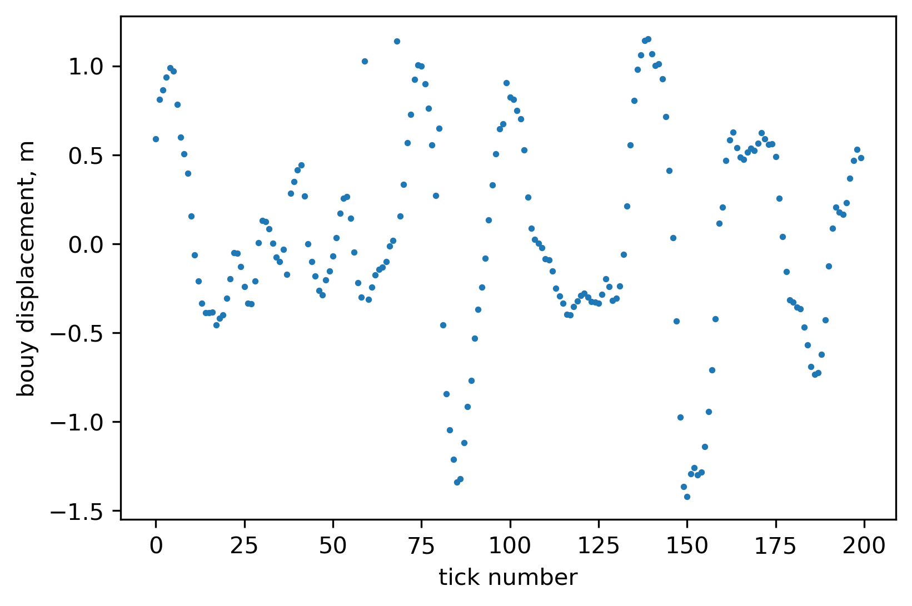

## Описание задачи Хакатона по идентификации аномалий

в данных волномерного буя Spotter, полученных в экспедиции АИ-63 Института океанологии РАН (29.09.2022 - 05.12.2022).

В репозитории предлагаются варианты решения, которые можно считать опорными:

`outliers_classification.ipynb` - решение в подходе классификации с использованием модели `Random Forests`

`outliers_detection_LR_model.ipynb` - решение в подходе идентификации аномалий по ошибке линейной авторегрессионной модели

`outliers_detection_RF_model.ipynb` - решение в подходе идентификации аномалий по ошибке авторегрессионной модели на базе модели машинного обучения `Random Forests`

`outliers_detection_dummy_model.ipynb` - примитивные решения для оценки минимального разумного уровня меры качества


```python
import numpy as np
import matplotlib.pyplot as plt
import numpy as np
import pandas as pd
import pickle
from tqdm import tqdm_notebook
from sklearn.metrics import f1_score
```


```python
with open('./public_bouy_data.pkl', 'rb') as f:
    data = pickle.load(f)
```


```python
len(data)
```


    40


```python
with open('./public_bouy_target.pkl', 'rb') as f:
    targets = pickle.load(f)
```


```python
data[0].shape
```


    (8693, 5)


```python
targets[0].shape
```


    (8693,)


## Отобразим данные


```python
# item = np.random.randint(len(data))
item=23
```


```python
# start = np.random.randint(data[item].shape[0]-200)
start = 6090
```


```python
data[item].head()
```

<table border="1" class="dataframe">
  <thead>
    <tr style="text-align: right;">
      <th></th>
      <th>dx</th>
      <th>dy</th>
      <th>dz</th>
      <th>t</th>
      <th>station</th>
    </tr>
  </thead>
  <tbody>
    <tr>
      <th>0</th>
      <td>-0.447491</td>
      <td>0.609415</td>
      <td>1.05373</td>
      <td>1.665209e+09</td>
      <td>0606_4339</td>
    </tr>
    <tr>
      <th>1</th>
      <td>-0.062228</td>
      <td>0.528534</td>
      <td>1.28533</td>
      <td>1.665209e+09</td>
      <td>0606_4339</td>
    </tr>
    <tr>
      <th>2</th>
      <td>0.360255</td>
      <td>0.337573</td>
      <td>1.59773</td>
      <td>1.665209e+09</td>
      <td>0606_4339</td>
    </tr>
    <tr>
      <th>3</th>
      <td>0.730211</td>
      <td>0.018035</td>
      <td>1.70275</td>
      <td>1.665209e+09</td>
      <td>0606_4339</td>
    </tr>
    <tr>
      <th>4</th>
      <td>0.983110</td>
      <td>-0.428559</td>
      <td>1.69486</td>
      <td>1.665209e+09</td>
      <td>0606_4339</td>
    </tr>
  </tbody>
</table>


```python
displacements = data[item][['dx','dy','dz']].values
displacements.shape
```


    (6751, 3)


```python
f = plt.figure(figsize=(6,4), dpi=300)
plt.scatter(np.arange(200), displacements[start:start+200, 1], s=3)
plt.xlabel('tick number')
plt.ylabel('bouy displacement, m');
```



​    


На диаграмме выше виден участок временного ряда измерений волномерного буя Spotter из экспедиции АИ-63, которая проходила с 29 сентября по 5 декабря 2022 г.

Измерения производятся заходами по 25-60 минут, за которые с буя получаются ряды измерений смещения по трем координатам.

В наборе данных, который представлен для анализа, есть аномалии (выбросы). Например, они явно видны на диаграмме выше. Природа таких аномалий может быть в сбоях оборудования или в необычных условиях измерений.

Задача, которую следует решить - найти такие аномалии с применением методов машинного обучения.


## Мера качества в задаче - F1-score

### Precision:

$$
P = \frac{TP}{TP+FP}
$$

### Recall:
$$
R = \frac{TP}{TP+FN}
$$

### F-score:

$$
F_{\beta} = (1+\beta^2)\frac{P*R}{\beta^2*P + R}
$$

## F1-score:

$$
F_1 = 2\frac{P*R}{P+R} = \frac{2*TP}{2*TP+FP+FN}
$$

## Вычисление меры F1-score


```python
from sklearn.metrics import f1_score
```


```python
pred_targets = ...

### BLAH BLAH BLAH computing pred_targets

### pred_targets: одномерный бинарный массив numpy,
###               по размеру совпадающий с массивом целевой переменной разметки аномалий true_targets
```


```python
pred_targets = np.concatenate(pred_targets)
pred_targets.shape
```


    (234482,)


```python
true_targets = np.concatenate(targets)
true_targets.shape
```


    (234482,)


```python
f1_score(true_targets, pred_targets)
```


    0.3687473147977659


## Оценка качества на тестовой выборке

Тестовая выборка хранится у организатора соревнования.

Для оценки качества на тестовой выборке, следует применить вашу модель идентификации (или классификации) аномалий на тестовых данных (файл `private_bouy_data.pkl`) и передать организатору одномерный бинарный массив numpy, содержащий вычисленную разметку аномалий.

Первичная проверка:
- результатом должен быть массив numpy, то есть, результат операции type() на этом массиве должен выдавать `numpy.ndarray`.

Например, вот так:


```python
type(pred_targets_test)
```


    numpy.ndarray


- массив должен быть размером `136430` значений
- массив должен быть одномерным, то есть, атрибут `.shape` должен выдавать следующий результат: `(136430,)`

например, вот так:


```python
pred_targets_test.shape
```


    (136430,)


- массив должен содержать бинарные значения (тип `bool`), то есть, атрибут `.dtype` этого массива должен выдавать `dtype('bool')`


```python
pred_targets_test.dtype
```


    dtype('bool')


Рекомендуемый способ передачи результата на оценку качества - файл с массивом, сериализованным с помощью библиотеки `pickle`. Выгрузить его можно следующим образом:


```python
with open('./pred_targets_test.pkl', 'wb') as f:
    pickle.dump(pred_targets_test, f)
```

